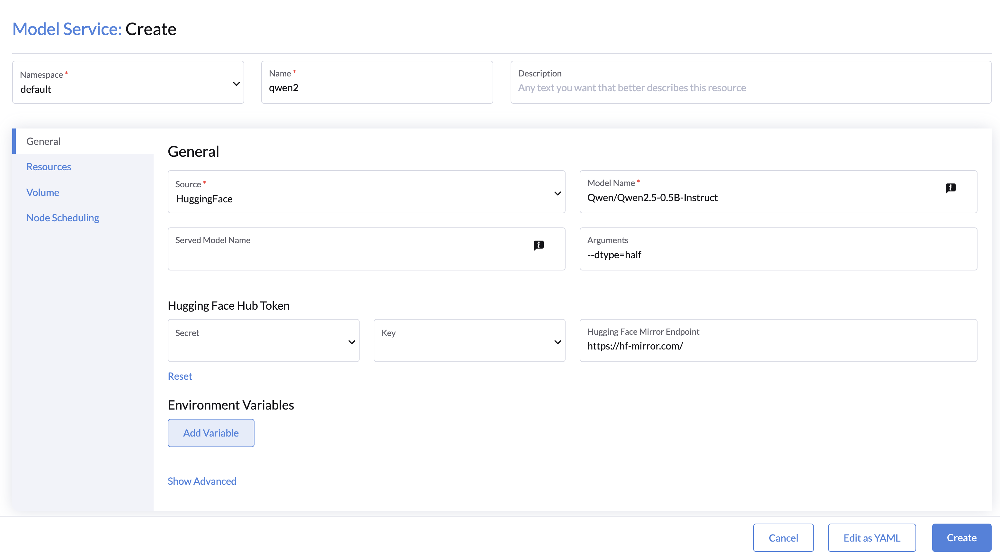
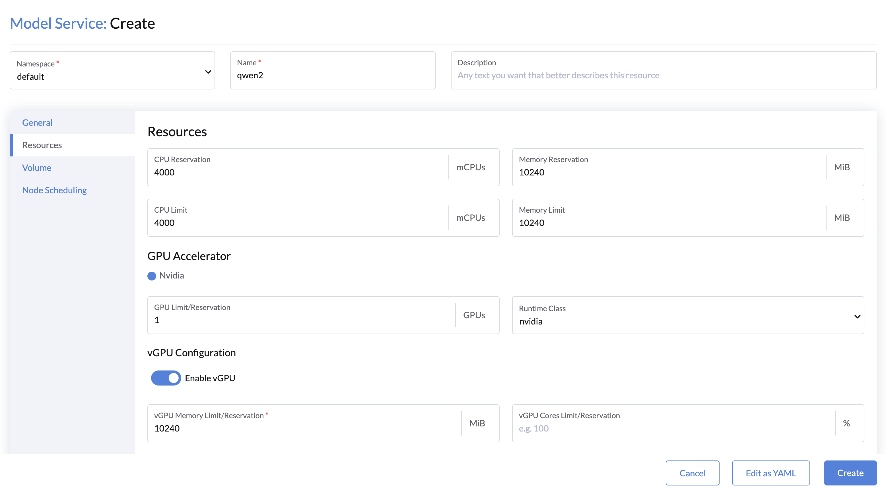
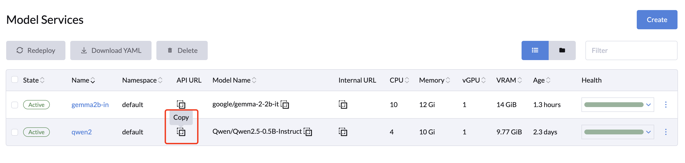

# LLMOS
[](https://github.com/llmos-ai/llmos/actions/workflows/main-release.yaml)
[](https://github.com/llmos-ai/llmos/releases)
[](https://goreportcard.com/report/github.com/llmos-ai/llmos)
[](https://discord.gg/5BnNqC5ccB)
[](https://github.com/llmos-ai/llmos/releases)

[LLMOS](https://llmos.1block.ai/) is an open-source, cloud-native AI infrastructure software designed to simplify the management of AI applications and Large Language Models (LLMs)  on your AI workstation or GPU machines.
With LLMOS, organizations can effortlessly deploy, scale, and operate machine learning workflows while reducing the complexity often associated with AI development and operations.


## Key Features

- **[Easy Installation](https://llmos.1block.ai/docs/installation/):** Works out of the box on both x86_64 and ARM64 architectures for a smooth installation experience.
- **[GPU Stack Management](https://llmos.1block.ai/docs/user_guide/gpu_management/enable-gpu-stack):** Offers virtual GPU (vGPU) and multi-accelerator support to enhance GPU resource utilization and operational flexibility.
- **[Machine Learning Cluster](https://llmos.1block.ai/docs/user_guide/ml_clusters):** Supports distributed computing with parallel processing capabilities and access to leading AI libraries, improving the performance of machine learning workflows—especially for large-scale models and datasets.
- **[Seamless Notebook Integration](https://llmos.1block.ai/docs/user_guide/notebooks):** Integrates with popular notebook environments such as **Jupyter**, **VSCode**, and **RStudio**, allowing data scientists and developers to work efficiently in familiar tools without complex setup.
- **[ModelService](https://llmos.1block.ai/docs/user_guide/modelservice) for LLM Serving:** Easily serve LLMs from [HuggingFace](https://huggingface.co/models), [ModelScope](https://modelscope.cn/models) or local path with **OpenAI-compatible APIs**.
- **[Monitoring & Alerts](https://llmos.1block.ai/docs/user_guide/monitoring/monitoring-management):** Easy to track cluster and GPU metrics in real-time with ready-to-use Grafana dashboards, Prometheus rules and alerts.
- **[Storage Management](https://llmos.1block.ai/docs/user_guide/storage/system-storage):** Provides built-in distributed storage with high-performance, fault-tolerant features. Offers robust, scalable block and filesystem storage tailored to the demands of AI and LLM applications.
- **[User](https://llmos.1block.ai/docs/user_and_auth/user) & [RBAC Management](https://llmos.1block.ai/docs/user_and_auth/role-template):** Simplifies user management with role-based access control (RBAC) and role templates, ensuring secure and efficient resource allocation.
- **Optimized for Edge & Branch Deployments:** Supports private deployments with optimized resource usage for running models and workloads in edge and branch networks. It also allows for horizontal scaling to accommodate future business needs.

## Use Cases

- **AI Research & Development:** Simplifies LLM and AI infrastructure management, enabling researchers to focus on innovation rather than operational complexities.
- **Enterprise AI Solutions:** Streamline the deployment of AI applications with scalable infrastructure, making it easier to manage models, storage, and resources across multiple teams.
- **Data Science Workflows:** With notebook integration and powerful cluster computing, LLMOS is ideal for data scientists looking to run complex experiments at scale.
- **AI-Driven Products:** From chatbots to automated content generation, LLMOS simplifies the process of deploying LLM-based products that can serve millions of users and scale up horizontally.


## Quick Start

Make sure your nodes meet the [requirements](https://llmos.1block.ai/docs/installation/requirements) before proceeding.

### Installation Script

LLMOS can be installed to a bare-metal server or a virtual machine. To bootstrap a **new cluster**, follow the steps below:

```shell
curl -sfL https://get-llmos.1block.ai | sh -s - --cluster-init --token mytoken
```

> For CN users, append `--mirror cn` to the end of the command to accelerate the installation.

To monitor installation logs, run `journalctl -u llmos -f`.

After installation, you may optionally add a worker node to the cluster with the following command:
```shell
curl -sfL https://get-llmos.1block.ai | LLMOS_SERVER=https://server-url:6443 LLMOS_TOKEN=mytoken sh -s -
```

### Config Proxy
If your environment requires internet access through a proxy, set the `HTTP_PROXY` and `HTTPS_PROXY` environment variables before running the installation script:

```shell
export HTTP_PROXY=http://proxy.example.com:8080
export HTTPS_PROXY=http://proxy.example.com:8080
export NO_PROXY=127.0.0.0/8,10.0.0.0/8,172.16.0.0/12,192.168.0.0/16 # Replace the CIDRs with your own
```

If you want to configure the proxy settings for `containerd` without affecting the node and LLMOS, you can prefix the variables with `CONTAINERD_`:

```shell
export CONTAINERD_HTTP_PROXY=http://proxy.example.com:8080
export CONTAINERD_HTTPS_PROXY=http://proxy.example.com:8080
export CONTAINERD_NO_PROXY=127.0.0.0/8,10.0.0.0/8,172.16.0.0/12,192.168.0.0/16 # Replace the CIDRs with your own
```

## Getting Started

After installing LLMOS, access the dashboard by navigating to `https://<server-ip>:8443` in your web browser.

1. LLMOS will create a default `admin` user with a randomly generated password. To retrieve the password, run the following command on the **cluster-init** node:
    ```shell
    kubectl get secret --namespace llmos-system llmos-bootstrap-passwd -o go-template='{{.data.password|base64decode}}{{"\n"}}'
    ```
   
1. Upon logging in, you will be redirected to the setup page. Configure the following:
    - Set a **new password** for the admin user (strong passwords are recommended).
    - Configure the **server URL** that all other nodes in your cluster will use to connect.
   
1. After setup, you will be redirected to the home page where you can start using LLMOS.
   

### Creating a Model Service

Next, you can optionally choose to serve LLMs from [HuggingFace](https://huggingface.co/models), [ModelScope](https://modelscope.cn/models) or local path with **OpenAI-compatible APIs**. 

1. Go to the **LLMOS Management > ModelService** page.
1. **Name and Namespace**: Provide the model service name and namespace.
1. **General Configurations**: 
   - **Model Source and Name**:
      - Select the model source: [Hugging Face](https://huggingface.co/models), [ModelScope](https://modelscope.cn/models), or a **Local Path**.
      - For Hugging Face or ModelScope models, paste the model name from the registry (e.g., `Qwen/Qwen2.5-0.5B-Instruct`).
      - For local path models, specify the volume path (e.g., `/root/.cache/huggingface/hub/models--Qwen--Qwen2.5-0.5B-Instruct`).
   - **Engine Arguments (Optional)**: Add arguments like `--dtype=half --max-model-len=4096` in the **Arguments** field if needed.
   - **Hugging Face Configurations (Optional)**:
      - Use a [secret credential](https://llmos.1block.ai/docs/user_guide/modelservice#adding-a-hugging-face-token) for models that need authentication.
      - Add a custom **Hugging Face Mirror URL** if using a proxy (e.g., `https://hf-mirror.com/`).
   - **Environment Variables (Optional)**: Add any extra environment variables as needed.
    
1. Add CPU, Memory and GPU Resources:
    - For large models, use **tensor parallelism** to distribute across multiple GPUs on the same node. For example, with 4 GPUs, it will set the tensor parallel size to 4.
    - To use a shared GPU device, enable **vGPU** and specify the `vGPU` memory size (in MiB) and `vGPU Cores` (default: 100%).
    
1. Click **Volume** to set up the model service's storage.
1. Click **Create** to finalize and create the model service.

**Results:** The Model Service will be created and displayed on the Model Services page, where you can test it using its [OpenAI-compatible APIs](https://llmos.1block.ai/docs/user_guide/modelservice/#accessing-model-service-apis).



## More Examples

To discover the capabilities of the LLMOS platform, explore the following examples:
- [Creating a Machine Learning Cluster](https://llmos.1block.ai/docs/user_guide/ml_clusters)
- [Creating a Jupyter Notebook](https://llmos.1block.ai/docs/user_guide/notebooks)
- [Chat with LLMOS Models](https://llmos.1block.ai/docs/user_guide/modelservice)
- [Monitoring GPU Metrics and Alerts](https://llmos.1block.ai/docs/user_guide/monitoring/monitoring-managemet)

## Documentation
Find more detailed documentation, visit [here](https://llmos.1block.ai/docs/).

## Community
If you're interested, please join us on [Discord](https://discord.gg/5BnNqC5ccB) or participate in [GitHub Discussions](https://github.com/llmos-ai/llmos/discussions) to discuss or contribute the project. We look forward to collaborating with you!

If you have any feedback or issues, feel free to file a GitHub [issue](https://github.com/llmos-ai/llmos/issues).

## License

Copyright (c) 2024 [1Block.AI.](https://1block.ai/)

Licensed under the Apache License, Version 2.0 (the "License");
you may not use this file except in compliance with the License.
You may obtain a copy of the License at

    http://www.apache.org/licenses/LICENSE-2.0

Unless required by applicable law or agreed to in writing, software
distributed under the License is distributed on an "AS IS" BASIS,
WITHOUT WARRANTIES OR CONDITIONS OF ANY KIND, either express or implied.
See the License for the specific language governing permissions and
limitations under the License.

