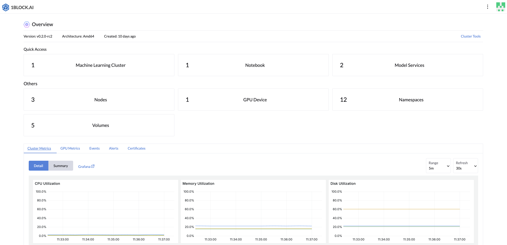

# LLMOS
[](https://github.com/llmos-ai/llmos/actions/workflows/main-release.yaml)
[](https://goreportcard.com/report/github.com/llmos-ai/llmos)
[](https://github.com/llmos-ai/llmos/releases)
[](https://discord.com/invite/stdb8GeE)

[LLMOS](https://llmos.1block.ai/) is an open-source, cloud-native infrastructure software tailored for managing AI applications and Large Language Models(LLMs).

## Key Features
- **Easy Installation:** Seamlessly install on x86_64 or ARM64 architectures for an out-of-the-box user experience.
- **Comprehensive LLM Lifecycle Management:** A unified interface for both developers and non-developers to manage LLM infrastructure, ML Clusters, models and workloads.
- **Easy to Use:** Build models and AI applications in your own way, without the need to managing Kubernetes & infrastructure directly.
- **Optimized for Edge & Branch Deployment:** Enhance resource efficiency and simplify model deployment in edge and branch networks, while maintaining the capability to scale horizontally for larger workloads.


## Quick Start

### Installation Script

LLMOS can be installed to a bare-metal server or a virtual machine. To bootstrap a **new cluster**, follow the steps below:

```shell
curl -sfL https://get-llmos.1block.ai | sh -s - --cluster-init --token mytoken
```

To monitor installation logs, run `journalctl -u llmos -f`.

After installation, you may optionally add a worker node to the cluster with the following command:
```shell
curl -sfL https://get-llmos.1block.ai | LLMOS_SERVER=https://server-url:6443 LLMOS_TOKEN=mytoken sh -s -
```

### Config Proxy
If your environment requires internet access through a proxy, set the `HTTP_PROXY` and `HTTPS_PROXY` environment variables before running the installation script:

```shell
export HTTP_PROXY=http://proxy.example.com:8080
export HTTPS_PROXY=http://proxy.example.com:8080
export NO_PROXY=127.0.0.0/8,10.0.0.0/8,172.16.0.0/12,192.168.0.0/16 # Replace the CIDRs with your own
```

## Getting Started

After installing LLMOS, access the dashboard by navigating to `https://<server-ip>:8443` in your web browser.

1. LLMOS will create a default `admin` user with a randomly generated password. To retrieve the password, run the following command on the **cluster-init** node:
    ```shell
    kubectl get secret --namespace llmos-system llmos-bootstrap-passwd -o go-template='{{.data.password|base64decode}}{{"\n"}}'
    ```
   
1. Upon logging in, you will be redirected to the setup page. Configure the following:
    - Set a **new password** for the admin user (strong passwords are recommended).
    - Configure the **server URL** that all other nodes in your cluster will use to connect.
      
1. After setup, you will be redirected to the home page where you can start using LLMOS.
   

## More Examples

To learn more about using LLMOS, explore the following resources:
- [Chat with LLMOS Models](https://llmos.1block.ai/docs/user_guide/llm_management/serve/)
- [Creating a Machine Learning Cluster](https://llmos.1block.ai/docs/user_guide/ml_clusters)
- [Creating a Jupyter Notebook](https://llmos.1block.ai/docs/user_guide/llm_management/notebooks/#create-a-notebook)

## Documentation
Find more detailed documentation, visit [here](https://llmos.1block.ai/docs/).

## Community
If you're interested, please join us on [Discord](https://discord.com/invite/stdb8GeE) or participate in [GitHub Discussions](https://github.com/llmos-ai/llmos/discussions) to discuss or contribute the project. We look forward to collaborating with you!

If you have any feedback or issues, feel free to file a GitHub [issue](https://github.com/llmos-ai/llmos/issues).

## License

Copyright (c) 2024 [1Block.AI.](https://1block.ai/)

Licensed under the Apache License, Version 2.0 (the "License");
you may not use this file except in compliance with the License.
You may obtain a copy of the License at

    http://www.apache.org/licenses/LICENSE-2.0

Unless required by applicable law or agreed to in writing, software
distributed under the License is distributed on an "AS IS" BASIS,
WITHOUT WARRANTIES OR CONDITIONS OF ANY KIND, either express or implied.
See the License for the specific language governing permissions and
limitations under the License.

